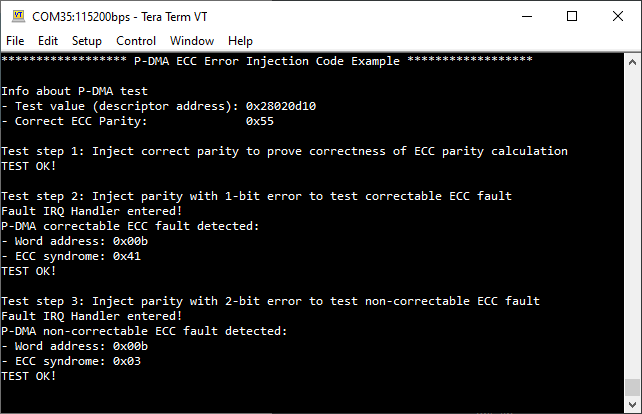

# P-DMA ECC Error Injection
**This code example demonstrates the usage of the ECC error injection feature to test the functionality of the ECC logic for the P-DMA channel configuration SRAM memory.**

## Requirements

- [ModusToolbox&trade;](https://www.infineon.com/modustoolbox) v3.0 or later (tested with v3.0)

## Supported toolchains (make variable 'TOOLCHAIN')

- GNU Arm&reg; Embedded Compiler v11.3.1 (`GCC_ARM`) – Default value of `TOOLCHAIN`

## Device
The device used in this code example (CE) is:
- [TRAVEO™ T2G CYT4BF Series](https://www.infineon.com/cms/en/product/microcontroller/32-bit-traveo-t2g-arm-cortex-microcontroller/32-bit-traveo-t2g-arm-cortex-for-body/traveo-t2g-cyt4bf-series/)

## Board
The board used for testing is:
- TRAVEO™ T2G evaluation kit ([KIT_T2G-B-H_EVK](https://www.infineon.com/evaluation-board/KIT-T2G-B-H-EVK), [KIT_T2G-B-H_LITE](https://www.infineon.com/evaluation-board/KIT-T2G-B-H-LITE))

## Scope of work

In this example, the ECC error injection mechanism is used to inject an error into the target P-DMA channel's SRAM word. When the target address is read, the P-DMA ECC logic triggers a fault through the central fault sub-system, indicating the error. The faults are then handled, and the fault information is displayed.

This example demonstrates Single Error Correction and Double Error Detection (SECDED).

## Introduction

**Peripheral DMA (P-DMA)**

P-DMA (Peripheral Direct Memory Access) is used to transfer data between memory and peripherals without CPU involvement: the CPU configures/programs the P-DMA but the actual transfer is done by the P-DMA controller. 

**P-DMA controller**

The P-DMA controller is a part of the CPU subsystem (CPUSS) and it controls data transfer between peripherals and memory. The P-DMA controller uses SRAM memory to store some fields of the channel configuration. The following fields of the channel configuration are part of the SRAM memory:

- *DWx_CH_STRUCTy_CH_CTL.P* 
- *DWx_CH_STRUCTy_CH_CTL.NS* 
- *DWx_CH_STRUCTy_CH_CTL.B* 
- *DWx_CH_STRUCTy_CH_CTL.PC*
- *DWx_CH_STRUCTy_CH_CTL.PREEMPTABLE*
- *DWx_CH_STRUCTy_CH_IDX.X_IDX* 
- *DWx_CH_STRUCTy_CH_IDX.Y_IDX*
- *DWx_CH_STRUCTy_CH_CURR_PTR.ADDR*

The SRAM is organized as 32-bit data words, and each channel uses two 32-bit SRAM data words:
- *DWx_CH_STRUCTy_SRAM_DATA0*
- *DWx_CH_STRUCTy_SRAM_DATA1*

The register field *DWx_CH_STRUCTy_CH_CURR_PTR.ADDR* is mapped to the SRAM data word 1 (*DWx_CH_STRUCTy_SRAM_DATA1*) and the rest of the register fields mentioned above are mapped to the SRAM data word 0 (*DWx_CH_STRUCTy_SRAM_DATA0*). As a result, CH_CTL, CH_IDX and CH_CURR_PTR writes only update a subset of a 32-bit SRAM data word.

**P-DMA ECC**

The P-DMA SRAM memory uses 7-bit SECDED parity for every 32 bits of data. The ECC logic supports Single Error Correction and Double Error Detection (SECDED).

**ECC correctable errors:** When the ECC logic detects a single-bit error, the error is corrected in the data returned to the P-DMA controller or on the bus and a fault is reported to the fault structure. 

**ECC non-correctable errors:** If the ECC logic detects an error with more than one bit wrong, the data cannot be corrected with the available ECC parity information. So, the ECC logic reports a fault to the fault structure.

Both ECC correctable errors and ECC non-correctable errors are reported to the central fault structure. 

The fault structure can be configured to catch the fault and trigger an interrupt. On trigger, the CPU enters the interrupt handler, through which the fault information can be retrieved and further action can be taken by the application. 

**ECC Error Injection**

ECC error injection is a mechanism to test whether the ECC logic is working as expected and also to verify the fault reporting path. 

For ECC fault injection, the system requires updating a complete 32-bit SRAM data word with a user-provided ECC parity at a specific SRAM location. To achieve this, the registers *DWx_CH_STRUCTy_SRAM_DATA0* and *DWx_CH_STRUCTy_SRAM_DATA1* are provided, giving access to specific SRAM locations.

Specifically, for a channel *y*, the *DWx_CH_STRUCTy_SRAM_DATA0* register provides access to SRAM word address *2y*, and the *DWx_CH_STRUCTy_SRAM_DATA1* register provides access to SRAM word address *2y + 1*. To illustrate the fault injection process, let's consider injecting a fault at SRAM word address 13 for channel 6.

Here are the steps for ECC fault injection:

1. Set *DWx_CTL_ECC_INJ_EN* to 1 to enable ECC fault injection.

2. Set *DWx_ECC_CTL0.WORD_ADDR* to 13 to specify SRAM word address 13 where the fault should be injected.

3. Set *DWx_ECC_CTL0.PARITY* to the faulting ECC parity value that you want to inject.

4. Perform a 32-bit write to *DWx_CH_STRUCT6_SRAM_DATA1* (since 2*6 + 1 = 13). The write data and the faulting parity will be written to SRAM word address 13, effectively injecting the fault.

In summary, enabling ECC fault injection, specifying the SRAM word address, and providing the faulting parity value allow you to perform a write operation to the appropriate SRAM_DATA register. The ECC logic will then store the configured ECC parity along with the data, and any mismatch detected during read operations will trigger a fault, indicating data corruption. This mechanism helps in testing the ECC logic and verifying the fault reporting path while protecting data integrity in the system.

More details of TRAVEO™ T2G CYT4BF Series can be found in Technical Reference Manual (TRM), Registers TRM and Data Sheet. (See the [here](https://www.infineon.com/products/microcontroller/32-bit-traveo-t2g-arm-cortex/for-body/t2g-cyt4bf#documents))

## Hardware setup

This CE has been developed for:
- TRAVEO™ T2G evaluation kit ([KIT_T2G-B-H_EVK](https://www.infineon.com/evaluation-board/KIT-T2G-B-H-EVK)) 
 
No changes are required from the board's default settings.

- TRAVEO™ T2G evaluation kit lite ([KIT_T2G-B-H_LITE](https://www.infineon.com/evaluation-board/KIT-T2G-B-H-LITE)) 
   
No changes are required from the board's default settings.

A UART serial connection should be made with the computer via the serial port (KitProg3 connector). Use a terminal emulator to see the output on the screen. In the terminal emulator settings, select the KitProg3 COM port and set the baud rate to 115200. 

## Implementation

This example performs three test steps to test the functionality of the ECC logic using the ECC error injection mechanism.

The channel 5 of P-DMA instance 0 is configured for performing ECC error injection. A dummy channel descriptor is defined and its address is used as the test value. This value is stored as the current descriptor address in the corresponding channel's SRAM word 1.

The absolute SRAM word address in a P-DMA instance is calculated based on the channel number and target SRAM word type. So, for channel 5 and SRAM word 1, the absolute SRAM word address is 11. This address and the faulting parity are stored in the corresponding register fields for injection and the ECC error injection feature is enabled. 

The configured parity is injected into the target address by reading the current value and writing back the same value to the SRAM word 1. The ECC logic will then store the configured ECC parity along with the data, and any mismatch detected during subsequent read operations will trigger a fault, indicating data corruption. The fault caused and the fault source information is displayed on the terminal program.

**STDOUT/STDIN setting**

Initialization of the GPIO for UART is done in the <a href="https://infineon.github.io/retarget-io/html/group__group__board__libs.html#gaddff65f18135a8491811ee3886e69707"><i>cy_retarget_io_init()</i></a> function.
- Initializes the pin specified by *CYBSP_DEBUG_UART_TX* as UART TX and the pin specified by *CYBSP_DEBUG_UART_RX* as UART RX (these pins are connected to KitProg3 COM port)
- The serial port parameters are 8N1 and 115200 baud

**Fault handling initialization**

API calls to initialize fault handling are done in *initFaultHandling()* function.
First, the fault status is cleared using <a href="https://infineon.github.io/mtb-pdl-cat1/pdl_api_reference_manual/html/group__group__sysfault__functions.html#ga0a2a097b9b1d69fb51806964639c7af7"><i>Cy_SysFault_ClearStatus()</i></a>. Then the fault structure 0 is configured to trigger an interrupt when it captures a P-DMA correctable or non-correctable ECC fault using <a href="https://infineon.github.io/mtb-pdl-cat1/pdl_api_reference_manual/html/group__group__sysfault__functions.html#gafb1516898b15bdc985a7460c7a9f7ca1"><i>Cy_SysFault_SetMaskByIdx()</i></a>, <a href="https://infineon.github.io/mtb-pdl-cat1/pdl_api_reference_manual/html/group__group__sysfault__functions.html#ga2b7d86c125f4c1d55ffabfecc3b31338"><i>Cy_SysFault_SetInterruptMask()</i></a> and finally <a href="https://infineon.github.io/mtb-pdl-cat1/pdl_api_reference_manual/html/group__group__sysfault__functions.html#ga883297a5695f829251d11fb1cc6b6b4c"><i>Cy_SysFault_Init()</i></a>.  
As a last step *handleFaultIrq()* is setup as an interrupt handler and the system and CPU interrupt are enabled by calling <a href="https://infineon.github.io/mtb-pdl-cat1/pdl_api_reference_manual/html/group__group__sysint__functions.html#gab2ff6820a898e9af3f780000054eea5d"><i>Cy_SysInt_Init()</i></a> and *NVIC_EnableIRQ()*.

**P-DMA initialization** 

Channel 5 of P-DMA instance 0 is used in this example. The SRAM words for this P-DMA channel are initialized to 0. 
SRAM word #1 of the P-DMA channel is configured to hold the current descriptor address which is normally configured via *CH_CURR_PTR* register of the channel using <a href="https://infineon.github.io/mtb-pdl-cat1/pdl_api_reference_manual/html/group__group__dma__channel__functions.html#ga4c5cca40de761c4b7827ce65538bf12d"><i>Cy_DMA_Channel_SetDescriptor()</i></a>.

**Parity calculation**

The parity value for the 32-bit test data at the provided P-DMA SRAM word address is calculated in the *getParityForValue()* function using the algorithm mentioned in the [Technical Reference Manual (TRM)](https://www.infineon.com/products/microcontroller/32-bit-traveo-t2g-arm-cortex/for-body/t2g-cyt4bf#documents) section *ECC for P-DMA Channel Configuration SRAMs*. 

**ECC error injection**

There are three steps performed to test the ECC behavior by injecting no error, 1-bit error and 2-bit error respectively. 

In each test case, the function *injectParity()* is called to enable the injection of the provided ECC parity value for the specified P-DMA channel and target SRAM word. This is done by writing the parity value and the target address to the corresponding fields of the *DW0_ECC_CTL0* register. Then the ECC error injection feature is enabled by setting the *DW_CTL_ECC_INJ_EN* field of the *DW0_CTL0* register. A write operation is then performed on the target SRAM data word to inject the provided and configured parity. Finally, ECC error injection is disabled again.

**Test step 1:** Inject correct parity to prove the correctness of the ECC parity calculation

In this test step, the correct parity is injected into the target SRAM word using *injectParity()*. Then a test read is performed on the target SRAM word address using the function *executeTestAccess()*.  

The test step is passed if no fault occurred and the data read is correct.

**Test step 2:** Inject parity with 1-bit error to test correctable ECC fault

A single-bit error is induced into the correct parity value by flipping one bit. This value is injected into the target SRAM word address using the function *injectParity()*. Then the target address is read by calling *executeTestAccess()*. This read action results in a fault struct interrupt and the CPU enters the fault IRQ handler *handleFaultIrq()*. In this handler, the fault source is verified and fault-specific data is displayed on the terminal program.  

The test step is passed if the injected ECC error has caused a fault interrupt, but the data read is correct.

**Test step 3:** Inject parity with 2-bit error to test non-correctable ECC fault

A two-bit error is induced into the correct parity by flipping two bits. This value is injected into the target SRAM word address using the function *injectParity()*. Then the target address is read by calling *executeTestAccess()*. This read action results in a fault struct interrupt and the CPU enters the fault IRQ handler *handleFaultIrq()*. In this handler, the fault source is verified and fault-specific data is displayed on the terminal program. However, the data will be still corrupt. So after the test, the descriptor is simply set again using <a href="https://infineon.github.io/mtb-pdl-cat1/pdl_api_reference_manual/html/group__group__dma__channel__functions.html#ga4c5cca40de761c4b7827ce65538bf12d"><i>Cy_DMA_Channel_SetDescriptor()</i></a> to repair the corruption.

The test step is passed if the injected 2-bit ECC error has caused a fault interrupt.

## Run and Test
For this example, a terminal emulator is required for displaying outputs. Install a terminal emulator if you do not have one. Instructions in this document use [Tera Term](https://teratermproject.github.io/index-en.html).

After code compilation, perform the following steps for flashing the device:
1. Connect the board to your PC using the provided USB cable through the KitProg3 USB connector.
2. Open a terminal program and select the KitProg3 COM port. Set the serial port parameters to 8N1 and 115200 baud.
3. Program the board using one of the following:
    - Select the code example project in the Project Explorer.
    - In the **Quick Panel**, scroll down, and click **[Project Name] Program (KitProg3_MiniProg4)**.
4. After programming, the code example starts automatically. Confirm that the messages are displayed on the UART terminal:

   *Figure 1. Terminal output on program startup* 

5. You can debug the example to step through the code. In the IDE, use the **[Project Name] Debug (KitProg3_MiniProg4)** configuration in the **Quick Panel**. For details, see the "Program and debug" section in the [Eclipse IDE for ModusToolbox™ software user guide](https://www.infineon.com/MTBEclipseIDEUserguide).

**Note:** **(Only while debugging)** On the CM7 CPU, some code in *main()* may execute before the debugger halts at the beginning of *main()*. This means that some code executes twice: once before the debugger stops execution, and again after the debugger resets the program counter to the beginning of *main()*. See [KBA231071](https://community.cypress.com/docs/DOC-21143) to learn about this and for the workaround.

**Expected behavior**

The terminal program displays the test value (descriptor address) and the correct ECC parity value of the test variable. Three test steps are performed and the terminal program displays the test description, fault information and test results.

Test step 1 is passed if the injected correct parity has caused no fault and the data read is correct.

Test step 2 is passed if the injected 1-bit ECC error has caused a fault interrupt, but the data read is correct.

Test step 3 is passed if the injected 2-bit ECC error has caused a fault interrupt.

## References            

Relevant Application notes are:
- [AN235305](https://www.infineon.com/assets/row/public/documents/10/42/infineon-an235305-getting-started-with-traveo-t2g-family-mcus-in-modustoolbox-applicationnotes-en.pdf?fileId=8ac78c8c8b6555fe018c1fddd8a72801) - GETTING STARTED WITH TRAVEO™ T2G FAMILY MCUS IN MODUSTOOLBOX™
- [AN220191](https://www.infineon.com/gated/infineon-an220191---how-to-use-direct-memory-access-dma-controller-in-traveot2g-family-ja-applicationnotes-ja_dcfc7b53-3e40-4493-9222-f01df2bb68ea) - HOW TO USE DIRECT MEMORY ACCESS (DMA) CONTROLLER IN TRAVEO II FAMILY 
- [AN219842](https://www.infineon.com/gated/infineon-an219842---how-to-use-interrupt-in-traveo-tm-t2g-applicationnotes-en_e814fbc2-fb47-47c2-b1f6-1b83394459aa) - How to use interrupt in TRAVEO™ II

ModusToolbox™ is available online:
- <https://www.infineon.com/modustoolbox>

Associated TRAVEO™ T2G MCUs can be found on:
- <https://www.infineon.com/cms/en/product/microcontroller/32-bit-traveo-t2g-arm-cortex-microcontroller/>

More code examples can be found on the GIT repository:
- [TRAVEO™ T2G Code examples](https://github.com/orgs/Infineon/repositories?q=topic%3Akit-t2g-b-h-lite&type=all&language=&sort=) for [KIT_T2G-B-H_LITE](https://www.infineon.com/evaluation-board/KIT-T2G-B-H-LITE)
- [TRAVEO™ T2G Code examples](https://github.com/orgs/Infineon/repositories?q=topic%3Akit-t2g-b-h-evk&type=all&language=&sort=) for [KIT_T2G-B-H_EVK](https://www.infineon.com/evaluation-board/KIT-T2G-B-H-EVK)

For additional training, visit our webpage:  
- [TRAVEO™ T2G trainings](https://www.infineon.com/training/microcontroller-trainings)

For questions and support, use the TRAVEO™ T2G Forum:  
- <https://community.infineon.com/t5/TRAVEO-T2G/bd-p/TraveoII>  
